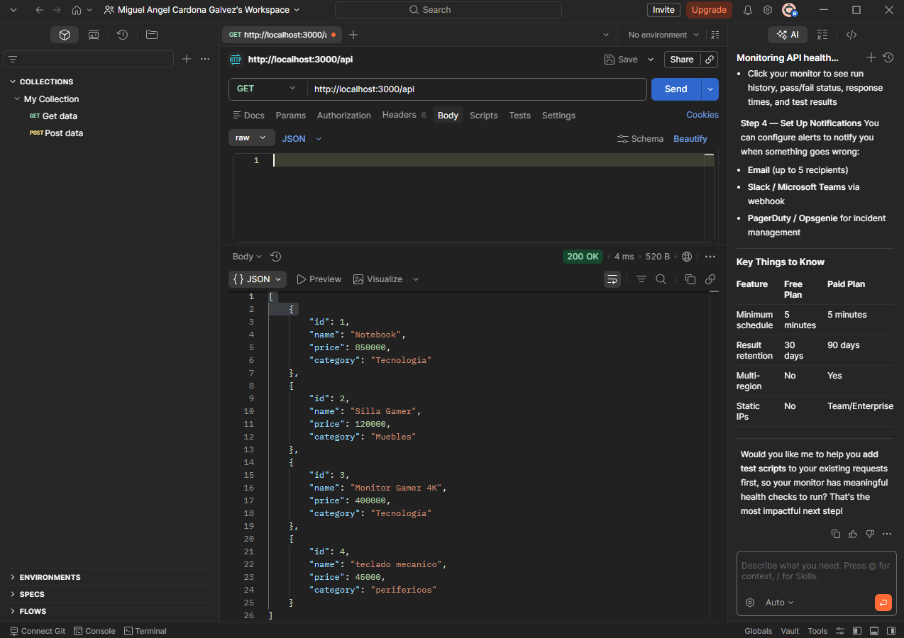
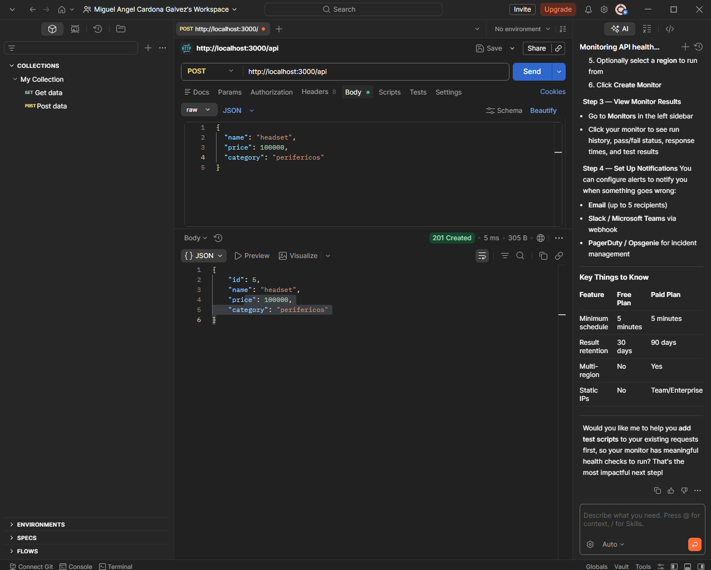
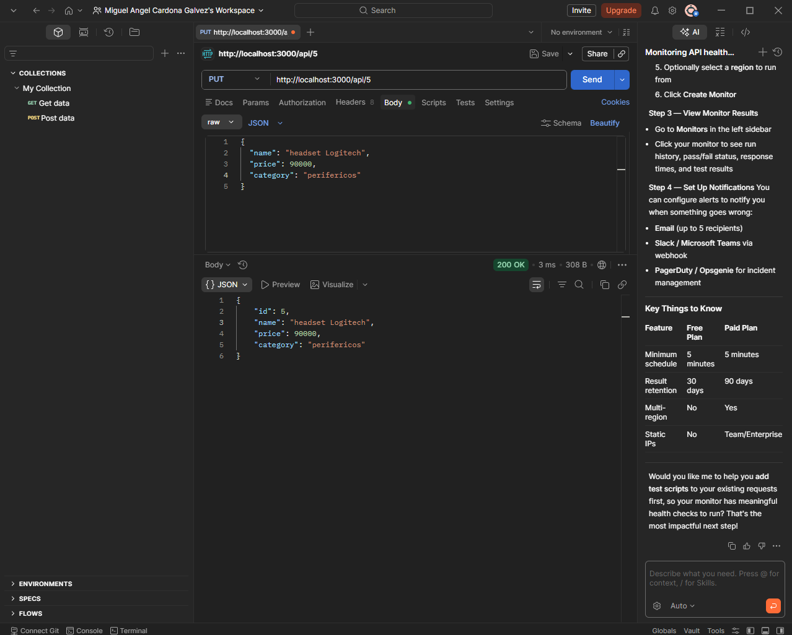
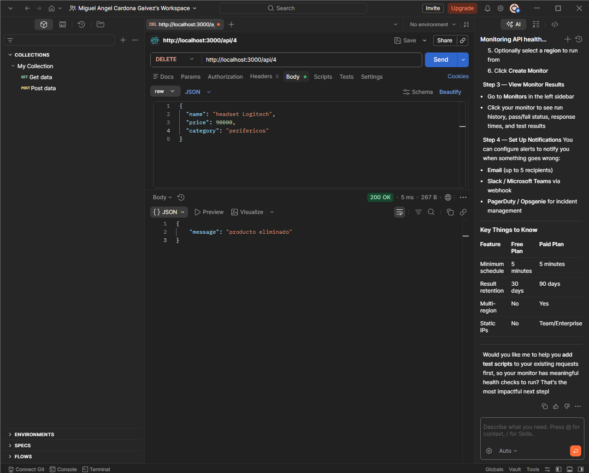

# API de Catálogo de Productos 📦

Esta es una API básica desarrollada con **Node.js** y **Express** que permite gestionar un inventario de productos mediante operaciones CRUD.

## 🛠️ Instalación y Ejecución

Para poner en marcha este proyecto en tu equipo local, sigue estos pasos:

1. **Instalar dependencias**:
   Escribe el siguiente comando en tu terminal para instalar los módulos necesarios después de descargar la carpeta:

   bash

   npm install

2. **iniciar el servidor**:  
   una vez instaladas las dependencias inicia el servidor con los siguientes comandos:

   bash

   node index.js

3. ## 🔗 Endpoints de la API

| Acción | Método | Ruta (Endpoint) | Descripción |
| :--- | :---: | :--- | :--- |
| **Listar productos** | `GET` | `/api` | [cite_start]Obtiene la lista completa de productos[cite: 723]. |
| **Crear producto** | `POST` | `/api` | [cite_start]Agrega un nuevo producto al catálogo[cite: 724]. |
| **Actualizar producto** | `PUT` | `/api/:id` | [cite_start]Modifica un producto existente usando su ID[cite: 725]. |
| **Eliminar producto** | `DELETE` | `/api/:id` | [cite_start]Borra un producto del sistema usando su ID[cite: 726]. |

4. **pruebas de funcionamiento**

### 1. Listar productos (GET)

### 2. Crear producto (POST)

### 3. Actualizar producto (PUT)

### 4. Eliminar producto (DELETE)

